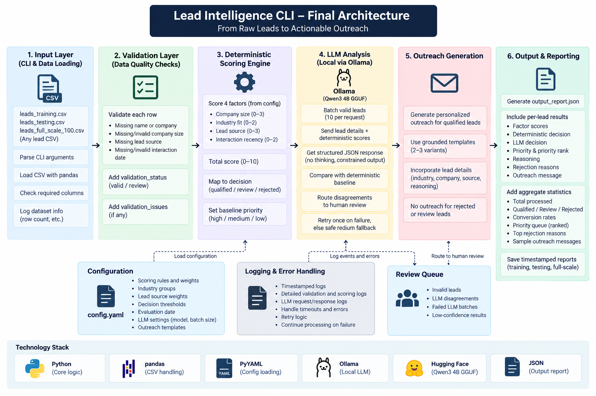

# Lead Intelligence CLI

A command-line tool that validates, scores, reviews, and prioritizes sales leads. It combines a deterministic qualification rubric with batched local LLM review and produces an actionable JSON report.

## Architecture



```text
Input → Validate → Score → LLM Review → Decide → Message → Report
```

Invalid leads remain under review and bypass the LLM. Valid leads are sent to Ollama in batches of 10. Any disagreement between the deterministic and LLM decisions is routed to human review.

## Setup

Requirements:

- Python 3.10+
- [Ollama](https://ollama.com/)
- A local Hugging Face GGUF model

```bash
python -m venv .venv
source .venv/bin/activate
pip install -r requirements.txt
brew install --cask ollama
ollama pull hf.co/Qwen/Qwen3-4B-GGUF:Q4_K_M
```

Create `.env`:

```env
OLLAMA_MODEL=hf.co/Qwen/Qwen3-4B-GGUF:Q4_K_M
OLLAMA_BASE_URL=http://localhost:11434
```

No paid API key is required.

## Usage

```bash
python main.py data/leads_training.csv
python main.py data/leads_testing.csv
python main.py data/leads_full_scale_100.csv
```

Each run writes `output_report.json`. The repository also includes preserved training and testing reports. Qualified leads are sorted by score, assigned a numeric `priority_rank`, and included in the report's `priority_queue`.

## Qualification rubric

| Factor | Points | Rules |
|---|---:|---|
| Company size | 0–3 | Ideal, large, small, enterprise, or micro bands |
| Industry fit | 0–2 | Core, adjacent, or unlisted industry |
| Lead source | 0–3 | Inbound demo receives the strongest weight |
| Interaction recency | 0–2 | Recent, moderately recent, or stale |

Decision thresholds:

- `8–10`: qualified, high priority
- `6–7`: qualified, medium priority
- `4–5`: review
- `0–3`: rejected

All scoring bands, industry groups, thresholds, the evaluation date, batch size, and outreach templates are configurable in `config.yaml`.

## LLM review and safeguards

- Model: `hf.co/Qwen/Qwen3-4B-GGUF:Q4_K_M`
- Runtime: local Ollama; thinking disabled
- Batch size: 10 valid leads per request
- Output: schema-constrained JSON
- Role: review the baseline decision and provide short qualitative reasoning
- Invalid numeric reasoning falls back to a deterministic explanation
- Failed batches retry once, then become `review` without stopping the run
- Qualified leads receive one of three grounded outreach variants using known lead details only

## Training result

The corrected 30-lead training run completed in about 2.5 minutes:

- 23 qualified, 5 review, and 2 rejected
- 100% LLM agreement with the deterministic baseline
- 20 guarded deterministic reasoning fallbacks
- 23 ranked leads with grounded outreach messages
- No failed batches or validation skips

## Full-scale result

The final 100-lead run completed without failed batches or manual intervention:

- 81 qualified
- 13 review
- 6 rejected
- 100% LLM agreement with the deterministic baseline
- 16 deterministic reasoning fallbacks
- 81 grounded outreach messages

## Assumptions and limitations

- The sample data has no ground truth; decisions are judged on consistency and explainability.
- The supplied training CSV contained 29 records (30 lines including its header); one complete synthetic lead was added so the training set now contains the documented 30 leads.
- Recency uses the fixed evaluation date `2024-01-20` for reproducible historical results.
- Industry fit reflects the configurable target-market assumptions.
- Local Ollama inference avoids paid API usage and keeps data on-device, with speed as the tradeoff. The 100-lead run took about 28 minutes and included significant latency spikes on the test hardware.
- The small model often repeats numeric scoring language, so guarded deterministic reasoning is used when necessary.
- `output_report.json` is overwritten on each run unless copied first.
